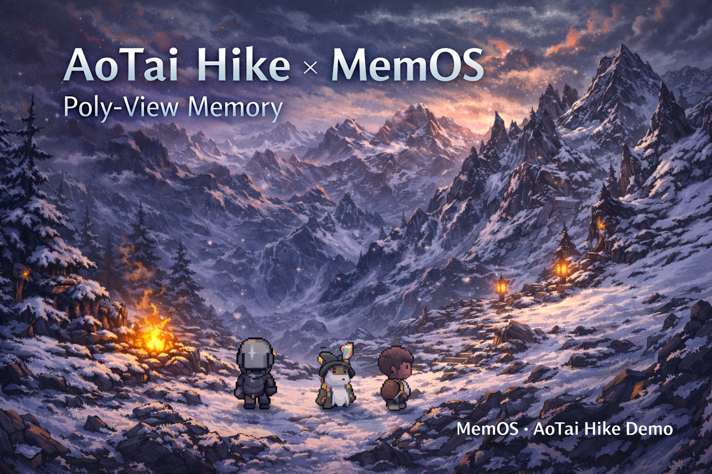

# 鳌太线徒步模拟器（AoTai Hike）Demo

> A pixel-art interactive narrative game demo based on the MemOS multi-view memory system

<div align="center">
  
</div>

## 📖 Overview

**鳌太线徒步模拟器（AoTai Hike）** is a Web game demo showcasing MemOS's multi-view memory capabilities. Players can create multiple roles, lead a team across the dangerous AoTai route, and experience memory-based intelligent NPC dialogues and dynamic storytelling.

### Key Highlights

- 🎮 **Multi-role roleplay**: Create and switch between multiple roles, each with an independent memory space
- 🧠 **Multi-view memory**: Fully integrated MemOS multi-view memory system
- 💬 **Intelligent NPC dialogue**: Generate personality-consistent dialogue based on role memory
- 🗺️ **Fixed route exploration**: Follow the real AoTai route and experience the full journey
- 🎨 **Pixel-art UI**: Use Phaser 3 to render pixel-art maps and role animations

**📚 For detailed documentation, see: [INTRODUCTION_ZH.md](./INTRODUCTION_ZH.md) | [INTRODUCTION_EN.md](./INTRODUCTION_EN.md)**

## 🚀 Quick Start

### Requirements

- Python 3.8+
- MemOS service (local or remote)

### Installation Steps

1. **Install backend dependencies**
```bash
cd backend
python -m venv .venv && source .venv/bin/activate
pip install -r requirements.txt
```

2. **Configure MemOS service address (optional)**
```bash
export MEMOS_API_BASE_URL=http://localhost:8002
```

3. **Start the service**
```bash
uvicorn app:app --host 0.0.0.0 --port 8010 --reload
```

4. **Access the game**
Open your browser and visit: `http://localhost:8010/demo/ao-tai/`

## 📡 Core API

- `GET /api/demo/ao-tai/map` - Get map information
- `POST /api/demo/ao-tai/session/new` - Create a new session
- `POST /api/demo/ao-tai/roles/upsert` - Create/Update a role
- `POST /api/demo/ao-tai/roles/quickstart` - Quick-create default roles
- `PUT /api/demo/ao-tai/session/active_role` - Switch active role
- `POST /api/demo/ao-tai/act` - Perform an action (core endpoint)

For detailed API documentation, see [INTRODUCTION_EN.md](./INTRODUCTION_EN.md#-api-documentation)

## 🏗️ Project Structure

```
demos/AOTAI_Hike/
├── backend/              # FastAPI backend
│   ├── aotai_hike/      # Game core code
│   │   ├── router.py    # API routes
│   │   ├── services/    # Game services
│   │   ├── adapters/    # Adapters (memory/dialogue/background)
│   │   └── world/       # Map data
│   └── app.py           # Application entry
├── frontend/            # Frontend (Phaser 3 + DOM UI)
│   ├── src/            # Source code
│   └── assets/          # Asset files
└── README.md           # This file
```

## 🔧 Extensible Interfaces

The game is designed to be "lightweight but extensible"; all intelligence-related features are isolated via adapters:

- `adapters/memory.py` - **MemoryAdapter**: Interface with MemOS memory system
- `adapters/companion.py` - **CompanionBrain**: NPC dialogue generation (based on MemOS chat_complete)
- `adapters/background.py` - **BackgroundProvider**: Background asset provider

## 📚 Related Documents

- [INTRODUCTION_ZH.md](./INTRODUCTION_ZH.md) - **Complete project introduction (中文)**
- [INTRODUCTION_EN.md](./INTRODUCTION_EN.md) - **Complete project introduction (English)**
- [backend/MEMORY_INTEGRATION.md](./backend/MEMORY_INTEGRATION.md) - Memory system interaction guide
- [PRD.md](./PRD.md) - Product requirements document

---

**Enjoy your AoTai hike!** 🏔️
